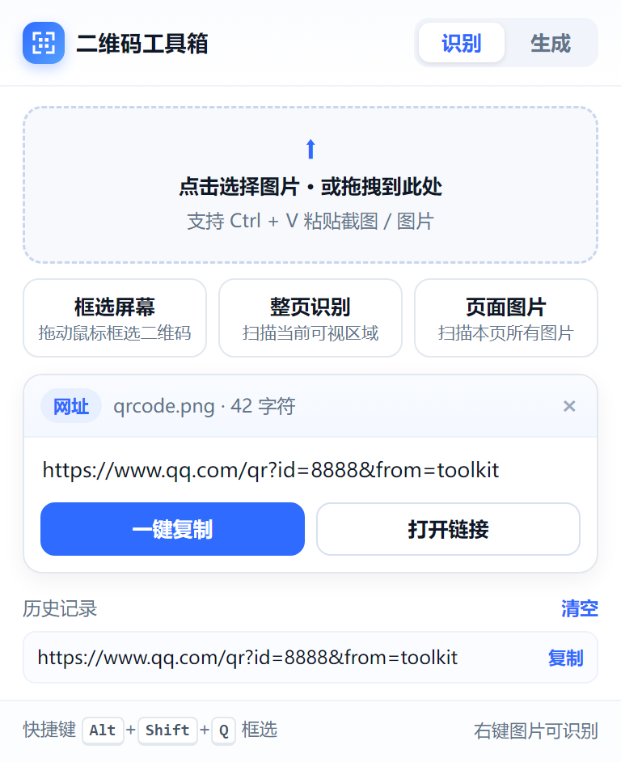

# 二维码工具箱 · QR Toolkit

一个 Chrome / Edge 通用的浏览器扩展（Manifest V3，零外部依赖、完全离线）：
**识别浏览器上的二维码 + 上传/粘贴图片识别 + 一键复制 + 输入内容生成二维码**。



## 功能一览

| 能力 | 说明 |
| --- | --- |
| 框选屏幕识别 | 在任意网页上拖动鼠标框选二维码区域，立即出结果（快捷键 `Alt+Shift+Q`） |
| 整页识别 | 一键截取当前可视区域并自动定位其中的二维码 |
| 页面图片 | 扫描当前页面所有图片，批量找出其中的二维码 |
| 右键识别 | 在任意图片上右键 →「识别这张图片里的二维码」 |
| 上传 / 粘贴 | 点击或拖拽图片到弹窗，也可直接 `Ctrl+V` 粘贴截图 |
| 一键复制 | 识别结果一键复制到剪贴板（页内结果卡片、历史记录同样支持点击复制） |
| 智能识别类型 | 自动判断网址 / WiFi / 名片 / 邮箱 / 电话 / 短信 / 地理位置 / 文本，网址可直接打开 |
| 生成二维码 | 输入任意内容实时生成，可调尺寸（256–768）、容错级别（L/M/Q/H）、前景/背景色，支持复制图片、下载 PNG |
| 历史记录 | 自动保存最近 30 条识别结果，点击即可再复制 |

## 安装（Chrome / Edge 相同）

1. 打开浏览器，地址栏输入 `chrome://extensions/`（Edge 为 `edge://extensions/`）并回车；
2. 打开右上角的 **开发者模式**；
3. 点击 **加载已解压的扩展程序**（Edge 为「加载解压缩的扩展」）；
4. 选择本目录 `qr-tool`（即包含 `manifest.json` 的那一层文件夹）；
5. 建议把扩展图标固定到工具栏（点击拼图图标 → 图钉）。

> 首次使用若提示「无法在当前页面运行」，通常是浏览器内置页面（`chrome://`、`edge://`、扩展商店页），
> 这类页面出于安全限制不允许注入脚本，切到普通网页即可。

## 使用

**装好后点击工具栏图标：**
- **识别**：上传/拖拽/粘贴图片 → 自动识别；或点「框选屏幕 / 整页识别 / 页面图片」。
- **生成**：切到「生成」标签，输入内容即时出码 → 「复制图片」直接粘贴到聊天窗口，或「下载 PNG」。

**在网页上：**
- 快捷键 `Alt+Shift+Q` 或右键菜单「框选区域识别二维码」→ 拖动框选 → 页面右下角弹出结果卡片，可一键复制。
- 在图片上右键 →「识别这张图片里的二维码」。
- 右键页面空白处 →「扫描本页所有图片中的二维码」。


## 目录结构

```
qr-tool/
├── manifest.json          # MV3 清单
├── background.js          # Service Worker：右键菜单、区域截屏、跨域图片抓取、存储
├── content.js             # 内容脚本：框选遮罩、页内结果卡片、页面图片扫描
├── popup.html/css/js      # 弹窗界面（识别 / 生成两个标签页）
├── lib/
│   ├── jsQR.js            # 识别库（MIT，257 KB）
│   ├── qrcode.js          # 生成库（qrcode-generator，MIT，57 KB）
│   └── decode.js          # 解码工具：多轮降级识别 + 内容类型判定
├── icons/                 # 16/48/128 图标（make_icons.py 可重新生成）
├── docs/                  # 界面截图
└── test/                  # 自动化测试（见下）
```

## 识别稳定性设计

`lib/decode.js` 对每个二维码做**四轮降级尝试**，显著提升小图、模糊图、低对比度图的识别率：

1. 原图直接解码（`inversionAttempts: attemptBoth`，同时尝试反色，兼容深底浅码）；
2. Otsu 自适应阈值二值化后解码；
3. 2 倍最近邻放大后解码（针对截图里很小的码）；
4. 3 倍放大 + 二值化解码。

截图识别时还会按「截图实际像素 / 视口尺寸」换算缩放比，自动兼容高 DPI 屏幕与页面缩放。

## 权限说明

| 权限 | 用途 |
| --- | --- |
| `activeTab` / `scripting` | 在你主动点击时向当前页面注入识别脚本（框选/扫描） |
| `contextMenus` | 提供右键识别菜单 |
| `storage` | 保存历史记录与最近一次结果（仅本地） |
| `downloads` | 保存生成的二维码 PNG |
| `clipboardWrite` | 一键复制结果、复制二维码图片 |
| `<all_urls>` 主机权限 | 右键识别跨域图片时抓取图片数据（绕过页面 CORS 限制） |

扩展不收集、不上传任何数据，所有识别与生成均在本地完成。

## 自动化测试

```bash
node test/roundtrip.js          # 纯算法：生成 → 渲染像素 → 多轮解码 往返（18 项）
node test/browser-smoke.js      # 真实浏览器：加载扩展 → 弹窗生成/解码/上传/复制 全链路
node test/content-script-test.js# 真实网页：内容脚本注入 → 页面图片扫描 → 框选截屏识别
node test/screenshots.js        # 重新生成 docs/ 下的界面截图
```

以上测试在本机 Edge 139 / Chrome 139 实测全部通过。

> 开发提示：正式版 Google Chrome 会忽略 `--load-extension` 命令行开关（自动化加载被策略限制），
> 因此 `test/*.js` 里的自动加载测试默认使用 Edge。手动「加载已解压的扩展程序」在 Chrome / Edge 上均可用。

## 常见问题

- **框选后没识别出来** → 二维码太小或太模糊时，先放大页面再框选；或改用「整页识别」。识别失败时卡片会提供「重新框选」按钮。
- **页面图片扫描很快结束但没有结果** → 部分网站图片是懒加载（滚动后才加载），先滚动页面再扫描；单次最多扫描 40 张、尺寸 ≥40px 的图片。
- **复制按钮提示「复制失败」** → 极少数页面限制了剪贴板权限，此时用结果卡片里的内容手动复制即可。
- **生成的二维码扫不出来** → 降低容错级别或缩短内容（内容过长时界面会给出提示）；打印场景建议容错选 H、静区保留默认。
